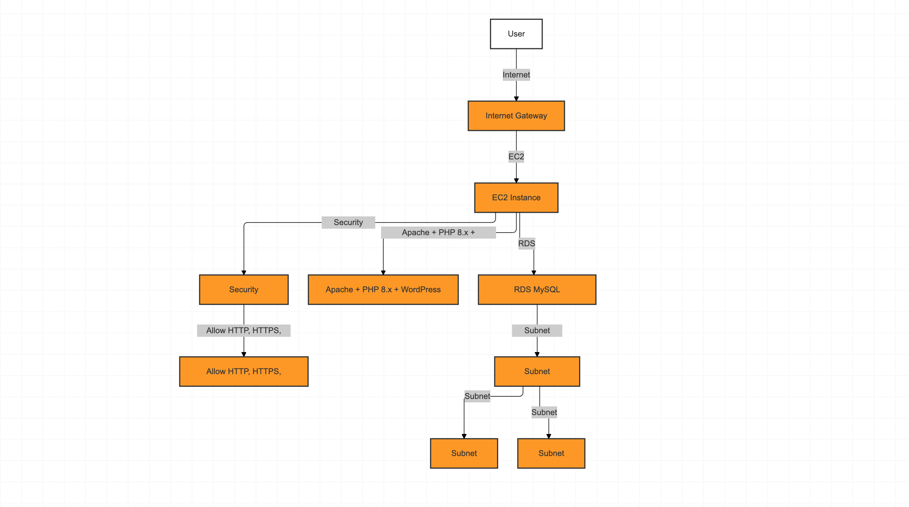
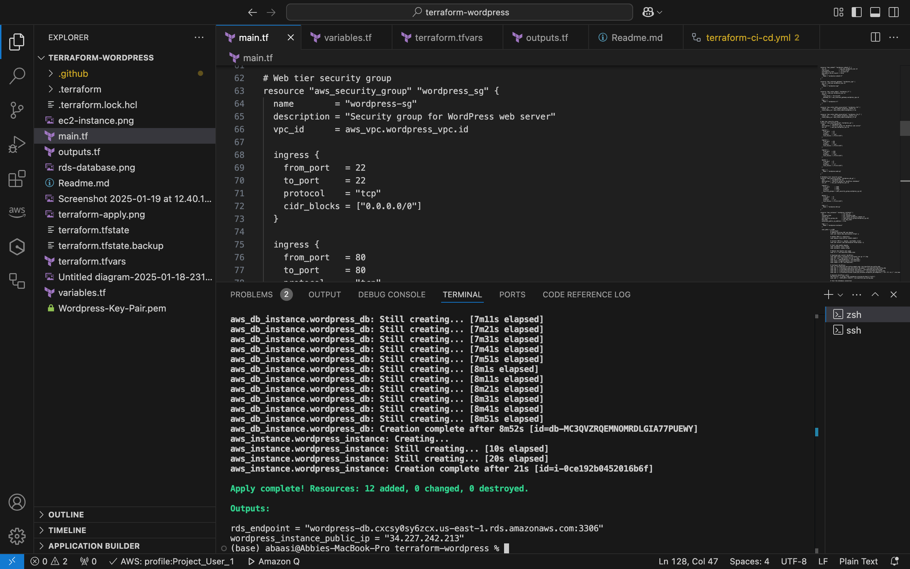
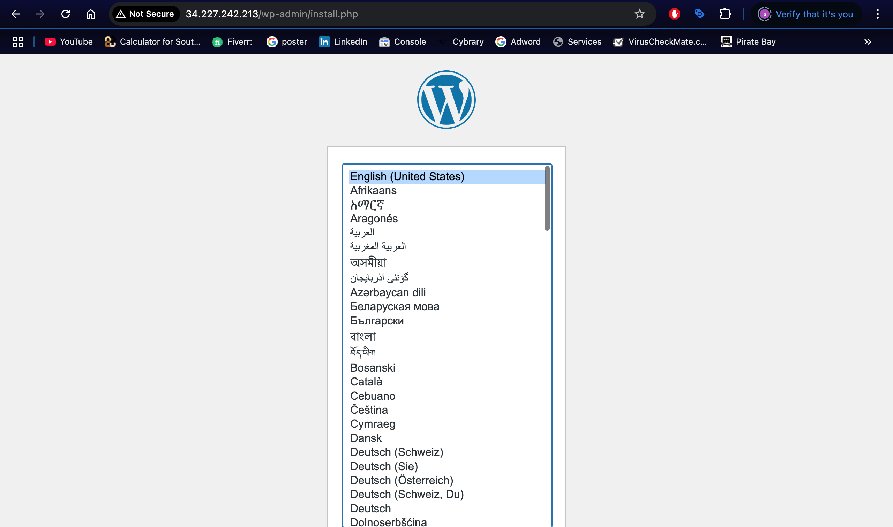
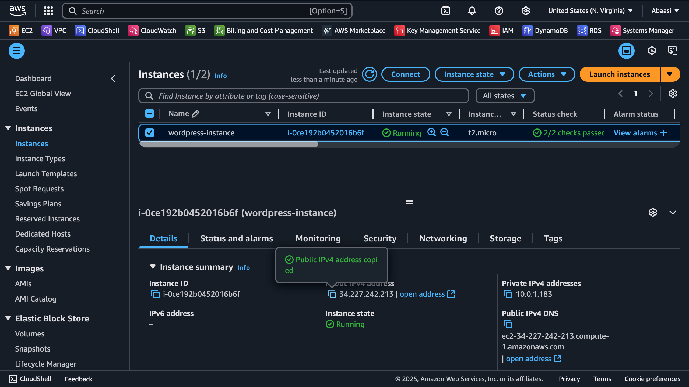
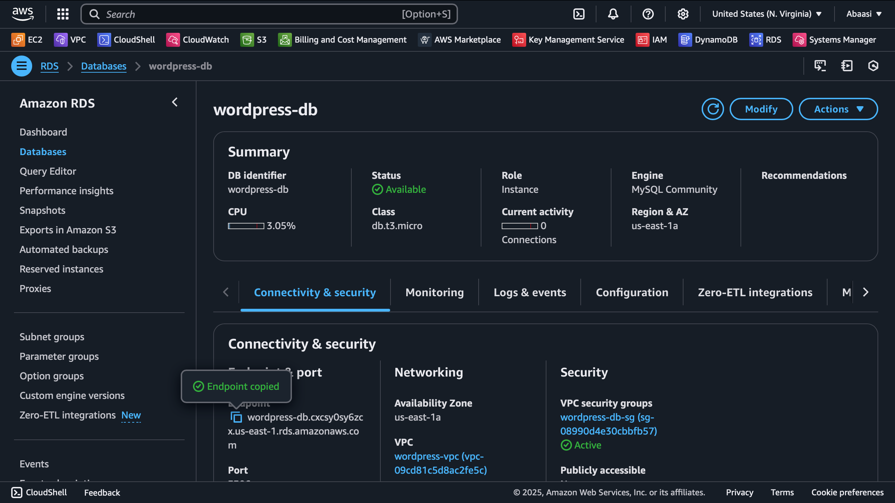

# WordPress Deployment on AWS using Terraform

**Author**: [Abaasi](https://www.linkedin.com/in/abaasi-k-b79420340)  
**GitHub**: [[Abaasi256](https://github.com/abaasi256)]  
**LinkedIn**: https://www.linkedin.com/in/abaasi-k-b79420340

---

## **Project Overview**
This project demonstrates how to deploy a **WordPress application** on **AWS** using **Terraform** and **CI/CD Pipeline**.
The infrastructure includes:
- **EC2 Instance**: Hosts the WordPress application with PHP 8.x and Apache.
- **RDS MySQL Database**: Stores WordPress data.
- **VPC, Subnets, and Security Groups**: Secure and isolate the resources.
- **Auto-Assign Public IP**: Ensures the EC2 instance is accessible over the internet.

---

## **Architecture Diagram**
Below is the architectural diagram of the deployment:
  
*Description*: Diagram of `architectural diagram` Infrastructure.

## **Features**
- **Infrastructure as Code**: Automated provisioning using Terraform.
- **Scalable WordPress Deployment**: EC2 instance with PHP 8.x and Apache.
- **Secure Database**: RDS MySQL database with multi-AZ support.
- **Public Access**: Auto-assign public IP for the EC2 instance.

---

## **Prerequisites**
1. **AWS Account**: Ensure you have an AWS account with sufficient permissions.
2. **Terraform Installed**: Download and install Terraform from [here](https://www.terraform.io/downloads.html).
3. **AWS CLI Installed**: Install the AWS CLI and configure it with `aws configure`.
4. **SSH Key Pair**: Create an SSH key pair in AWS or use an existing one.

---

## **CI/CD Pipeline**
This project includes a GitHub Actions workflow to automate Terraform validation and deployment. The pipeline performs the following steps:
1. **Terraform Init**: Initializes the Terraform configuration.
2. **Terraform Validate**: Validates the Terraform configuration.
3. **Terraform Plan**: Generates an execution plan.
4. **Terraform Apply**: Applies the Terraform configuration (only on the `main` branch).

To use the pipeline:
1. Add your AWS credentials as GitHub Secrets (`AWS_ACCESS_KEY_ID` and `AWS_SECRET_ACCESS_KEY`).
2. Push changes to the `main` branch to trigger the pipeline.

---

## **Steps to Deploy**
1. Clone this repository:
   ```bash
   git clone https://github.com/abaasi256/terraform-wordpress-deployment.git
   cd terraform-wordpress-deployment
   ```
2. Update the `terraform.tfvars` file with your AWS credentials and configuration:
   ```hcl
   aws_region = "us-east-1"
   ami_id = "ami-0c02fb55956c7d316"  # Replace with a valid AMI ID for your region
   instance_type = "t2.micro"
   key_name = "your-key-pair-name"
   db_name = "wordpressdb"
   db_user = "admin"
   db_password = "your-strong-password"
   availability_zone = "us-east-1a"
   ```
3. Initialize and apply the Terraform configuration:
   ```bash
   terraform init
   terraform plan
   terraform apply
   ```
4. Access the WordPress application:
   - Open a web browser and navigate to:
     ```
     http://<EC2-Public-IP>
     ```
   - Complete the WordPress installation wizard.

---

## **Outputs**
- **EC2 Instance Public IP**:
  ```bash
  terraform output wordpress_instance_public_ip
  ```
- **RDS Endpoint**:
  ```bash
  terraform output rds_endpoint
  ```

---

## **Clean Up**
To destroy the infrastructure:
```bash
terraform destroy
```

---

## **Screenshots**
Here are some suggested screenshots for your project:

### **1. Terraform Apply Output**
  
*Description*: Output of `terraform apply` after successfully deploying the infrastructure.

### **2. WordPress Installation Page**
  
*Description*: WordPress installation page accessed via the EC2 instance's public IP.

### **3. EC2 Instance in AWS Console**
  
*Description*: EC2 instance in the AWS Management Console, showing the public IP and running state.

### **4. RDS Database in AWS Console**
  
*Description*: RDS database in the AWS Management Console, showing the endpoint and status.

---

## Contributors
- **Abaasi**: Project author and maintainer.

---

## About the Author
Hi, I'm **Abaasi**, a cloud and DevOps enthusiast passionate about automating infrastructure using Terraform. This project is a reflection of my skills and expertise in AWS and Infrastructure as Code (IaC). Connect with me on [LinkedIn](https://www.linkedin.com/in/abaasi-k-b79420340) or check out my other projects on [GitHub](https://github.com/abaasi256).

---

## License
This project is licensed under the MIT License. See the [LICENSE](LICENSE) file for details.

---